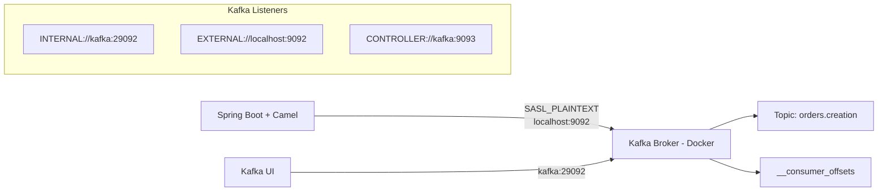
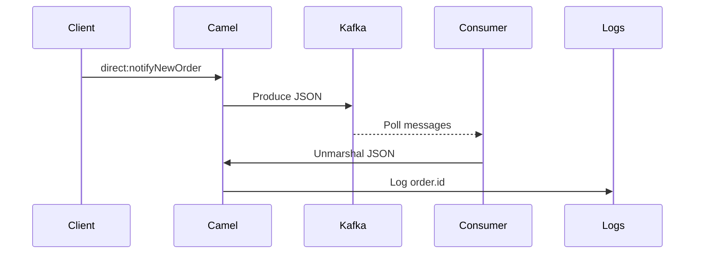

# 🚀 Spring Boot + Apache Camel + Apache Kafka (KRaft + SASL)


Proyecto de integración basado en **Spring Boot + Apache Camel** que implementa:

- ✅ Producción de eventos a Kafka
- ✅ Consumo de eventos con deserialización JSON
- ✅ Seguridad SASL/PLAIN
- ✅ Kafka en modo KRaft (sin Zookeeper)
- ✅ Kafka UI para monitoreo
- ✅ Configuración optimizada para entorno single-node

---

# 🏗 Arquitectura General



---

# 📦 Stack Tecnológico

- Spring Boot
- Apache Camel
- Apache Kafka (KRaft mode)
- Docker & Docker Compose
- Kafka UI

---

# 🚀 Levantar el Cluster Kafka + UI

## docker-compose.yml

```yaml
version: '3.8'

services:
  kafka:
    image: apache/kafka:latest
    container_name: kafka
    ports:
      - "9092:9092"
    environment:
      # =============================
      # KRaft Configuration
      # =============================
      KAFKA_PROCESS_ROLES: broker,controller
      KAFKA_NODE_ID: 1
      KAFKA_CONTROLLER_LISTENER_NAMES: CONTROLLER
      KAFKA_CONTROLLER_QUORUM_VOTERS: 1@kafka:9093

      # =============================
      # Listeners
      # =============================
      KAFKA_LISTENERS: INTERNAL://:29092,EXTERNAL://:9092,CONTROLLER://:9093
      KAFKA_ADVERTISED_LISTENERS: INTERNAL://kafka:29092,EXTERNAL://localhost:9092
      KAFKA_LISTENER_SECURITY_PROTOCOL_MAP: INTERNAL:SASL_PLAINTEXT,EXTERNAL:SASL_PLAINTEXT,CONTROLLER:PLAINTEXT
      KAFKA_INTER_BROKER_LISTENER_NAME: INTERNAL

      # =============================
      # SASL Configuration
      # =============================
      KAFKA_SASL_ENABLED_MECHANISMS: PLAIN
      KAFKA_SASL_MECHANISM_INTER_BROKER_PROTOCOL: PLAIN

      # =============================
      # Single Node Critical Config
      # =============================
      KAFKA_OFFSETS_TOPIC_REPLICATION_FACTOR: 1
      KAFKA_TRANSACTION_STATE_LOG_REPLICATION_FACTOR: 1
      KAFKA_TRANSACTION_STATE_LOG_MIN_ISR: 1

  kafka-ui:
    image: provectuslabs/kafka-ui
    container_name: kafka-ui
    ports:
      - "8080:8080"
    environment:
      KAFKA_CLUSTERS_0_NAME: local
      KAFKA_CLUSTERS_0_BOOTSTRAPSERVERS: kafka:29092
      KAFKA_CLUSTERS_0_PROPERTIES_SECURITY_PROTOCOL: SASL_PLAINTEXT
      KAFKA_CLUSTERS_0_PROPERTIES_SASL_MECHANISM: PLAIN
      KAFKA_CLUSTERS_0_PROPERTIES_SASL_JAAS_CONFIG: >
        org.apache.kafka.common.security.plain.PlainLoginModule required
        username="admin"
        password="admin-secret";
```

---

## ▶ Levantar entorno

```bash
docker compose down -v
docker compose up -d
```

---

# 🔄 Flujo de Producción y Consumo



---

# 📨 Producción

```java
from("direct:notifyNewOrder")
    .routeId("notify-new-order")
    .marshal().json()
    .to("kafka:orders.creation");
```

---

# 📥 Consumo

```java
from("kafka:orders.creation?autoOffsetReset=earliest")
    .routeId("kafka-orders-creation-consumer")
    .log("Consuming new message from Kafka topic ${headers[kafka.TOPIC]}")
    .unmarshal().json(Order.class)
    .log("Consumed order id ${body.id}");
```

---

# 🖥 Kafka UI

Acceder a:

```
http://localhost:8080
```

Permite:

- Visualizar topics
- Ver particiones
- Monitorear consumer groups
- Publicar mensajes manualmente
- Inspeccionar offsets

---